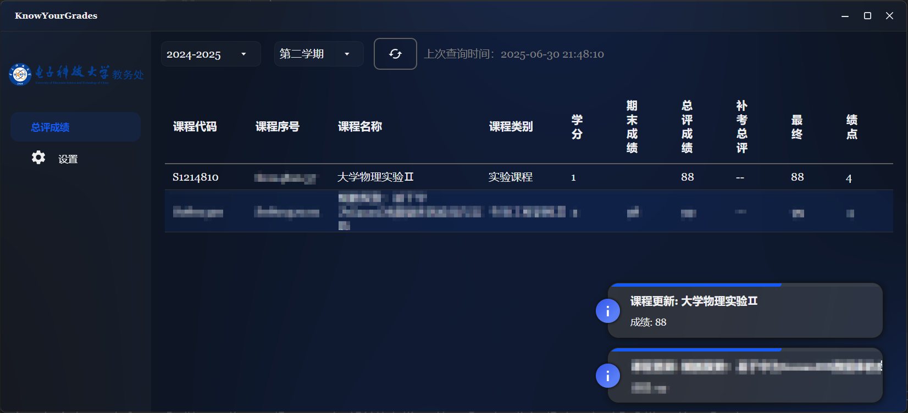

# UESTCJWCWatchdog

一个用于自动监控和提醒电子科大教务处总评成绩和平时成绩变动的软件。支持每小时自动拉取成绩，若有新成绩将弹窗提示并播放提示音。

## 项目简介

- `KnowYourGrades` 文件夹：GUI 程序源代码，基于 AvaloniaUI 开发。
- `Spider` 文件夹：用于从教务处爬取信息的 Python 源码。

## GUI 使用说明

1. 在设置中填写学号和密码。
2. 选择正确的学年和学期。
3. 点击总评页面的刷新按钮获取当前成绩数据。
4. 在设置中勾选“自动更新”，即可在成绩更新时收到提醒。

## 其他说明

- 建议学年和学期设置后不要随意更改，以免影响数据准确性。
- 如有问题欢迎提交 Issue 或 PR。
- 显然无法在关闭后获取成绩。

## 功能指标

- [ ] 平时成绩查询
- [ ] cookie管理
- [x] 每小时自动检查成绩更新。
- [x] 成绩更新时弹窗提示。
- [x] 成绩更新时播放提示音。
- [x] 支持多学年和学期选择。
- [x] 支持成绩数据的手动刷新。
- [x] 数据持久化。
- [x] GUI 界面友好，易于操作。
